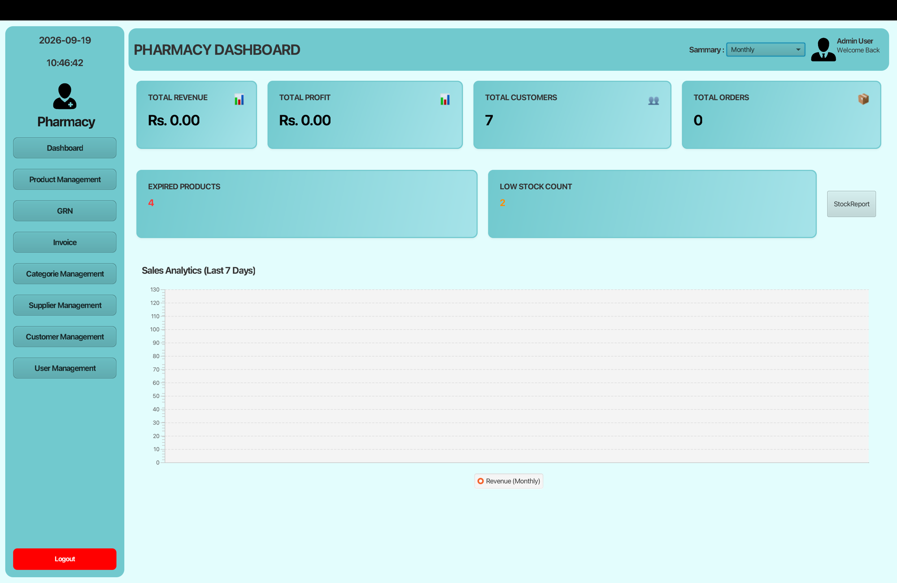
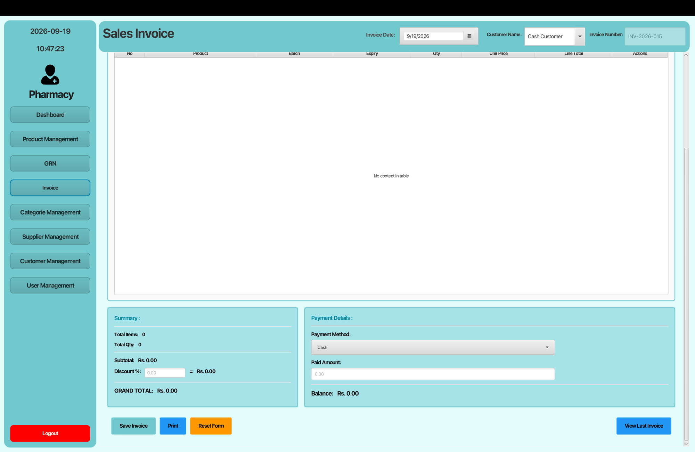
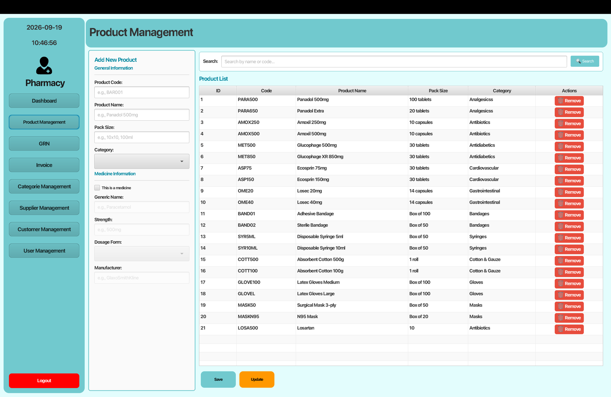
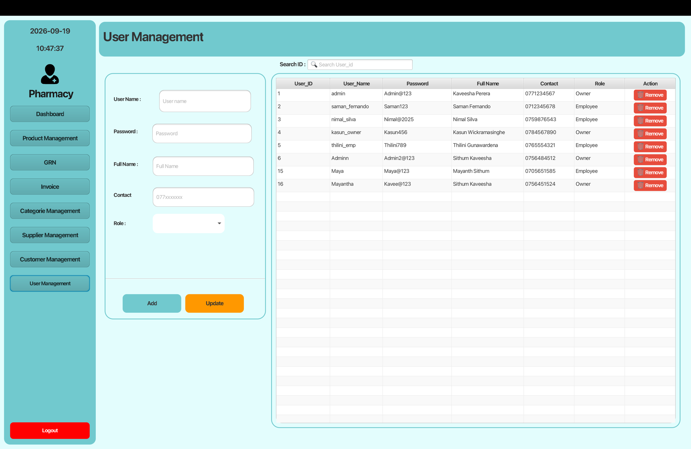

# Pharmacy Management System – MVC Architecture

A desktop **Pharmacy Management System** developed in **Java** using **JavaFX** for the UI and **MySQL** for data storage.  
This version is built using the **MVC (Model–View–Controller)** architectural pattern for clear separation of concerns.

**Repository:** [Mayantha2003/Pharmacy-Project-MVC-Architecture-](https://github.com/Mayantha2003/Pharmacy-Project-MVC-Architecture-)

---

## Features

- **User Authentication** – Secure login for admin/staff
- **Dashboard** – Overview of customers, stock, revenue, profit, orders, and expiry alerts
- **Product Management** – Add, update, delete, and search products
- **Category Management** – Organize medicines by category
- **Customer Management** – Maintain customer records
- **Supplier Management** – Manage supplier details
- **GRN (Goods Received Note)** – Record stock purchases from suppliers with batch tracking
- **Invoice / Billing** – Create sales invoices and process payments
- **User Management** – Manage system users
- **Stock Alerts** – Low stock and expired medicine notifications
- **Reports** – JasperReports for invoices and low-stock reports
- **Modern UI** – JavaFX FXML-based clean interface

---

## Screenshots

### Login


### Dashboard


### Product Management


### Sales Invoice


### User Management


---

## Tech Stack

| Component        | Technology                      |
|------------------|---------------------------------|
| Language         | Java 21                         |
| UI Framework     | JavaFX 21 (FXML + Controls)     |
| Build Tool       | Maven                           |
| Database         | MySQL                           |
| JDBC Driver      | MySQL Connector/J 9.x           |
| Reporting        | JasperReports 7.x               |
| Architecture     | **MVC** (Model–View–Controller) |

---

## Project Architecture (MVC)

```
┌─────────────────────────────────────┐
│              View (FXML)            │  UI screens (Login, Dashboard, Product, etc.)
└─────────────────┬───────────────────┘
                  │
┌─────────────────▼───────────────────┐
│           Controller Layer          │  Handles user events & UI logic
│         (JavaFX Controllers)        │
└─────────────────┬───────────────────┘
                  │
┌─────────────────▼───────────────────┐
│             Model Layer             │  Business logic & database operations
│              (Models)               │
└─────────────────┬───────────────────┘
                  │
┌─────────────────▼───────────────────┐
│              Database               │  MySQL (pharmacy_db)
└─────────────────────────────────────┘
```

**Supporting packages:**
- `dto` – Data Transfer Objects
- `dbc` – Database connection (Singleton)
- `util` – Helper utilities (CrudUtil, SessionManager)

---

## Prerequisites

- **JDK 21** or higher
- **Maven 3.8+**
- **MySQL Server 8.x** (or compatible)
- **IDE** (IntelliJ IDEA / Eclipse / NetBeans / VS Code) – optional but recommended

---

## Database Setup

1. Create a MySQL database:
   ```sql
   CREATE DATABASE pharmacy_db;
   ```

2. Update database credentials in:
   ```
   src/main/java/lk/ijse/pharmacymanagmentsystem/dbc/DBConnection.java
   ```
   Default values:
   ```java
   jdbc:mysql://localhost:3306/pharmacy_db
   username: root
   password: mysql
   ```

3. Create the required tables (products, categories, customers, suppliers, users, batches, grn, invoice, etc.) according to your schema.

> **Note:** Make sure the database schema matches the Model and DTO implementations in the project.

---

## How to Run

### Option 1 – Using Maven

```bash
# Clone the repository
git clone https://github.com/Mayantha2003/Pharmacy-Project-MVC-Architecture-.git
cd Pharmacy-Project-MVC-Architecture-

# Build the project
mvn clean compile

# Run the application
mvn javafx:run
```

### Option 2 – Using IDE

1. Open the project in IntelliJ IDEA / Eclipse / NetBeans.
2. Ensure the JDK is set to **21**.
3. Run the main class:
   ```
   lk.ijse.pharmacymanagmentsystem.App
   ```

---

## Project Structure

```
Pharmacy-Project-MVC-Architecture-/
├── src/main/java/lk/ijse/pharmacymanagmentsystem/
│   ├── controller/          # Controllers (MVC - Controller)
│   ├── model/               # Models (MVC - Model)
│   ├── dto/                 # Data Transfer Objects
│   ├── dbc/                 # Database Connection
│   ├── util/                # Utilities
│   └── App.java             # Main Application (entry point)
├── src/main/resources/
│   └── lk/ijse/pharmacymanagmentsystem/
│       ├── *.fxml           # Views (MVC - View)
│       ├── image/           # Icons & images
│       └── report/          # JasperReports (.jrxml)
├── screenshots/             # Application screenshots
├── pom.xml
└── README.md
```

---

## Main Modules

| Module       | Description                                      |
|--------------|--------------------------------------------------|
| Login        | User authentication                              |
| Dashboard    | Stats, charts, low-stock & expiry alerts         |
| Product      | Medicine/product CRUD + batch awareness          |
| Category     | Product categories                               |
| Customer     | Customer management                              |
| Supplier     | Supplier management                              |
| GRN          | Goods Received Notes (purchase + stock in)       |
| Invoice      | Sales invoicing & payments                       |
| User         | System user management                           |

---

## Author

**G. D. Mayantha**  
GitHub: [Mayantha2003](https://github.com/Mayantha2003)

---

## License

This project is intended for educational / portfolio purposes.
